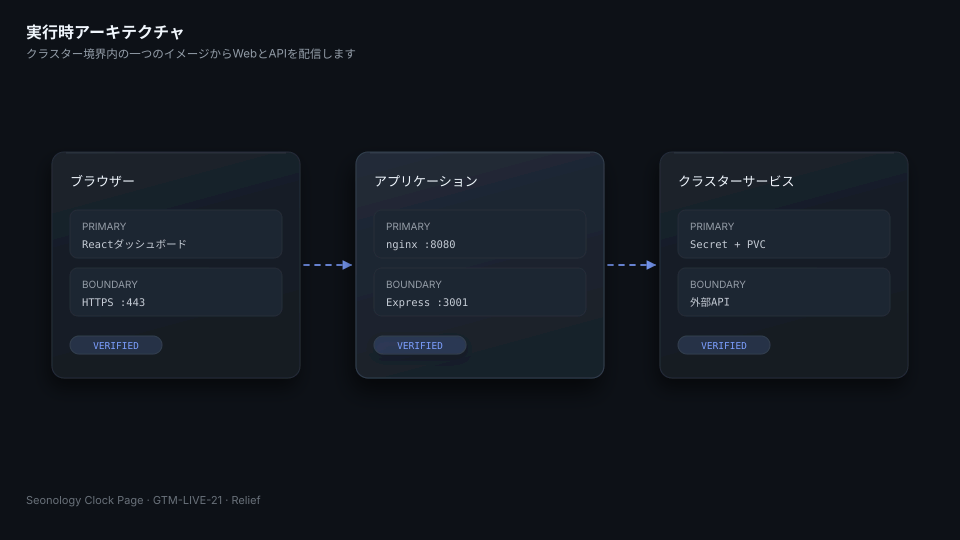
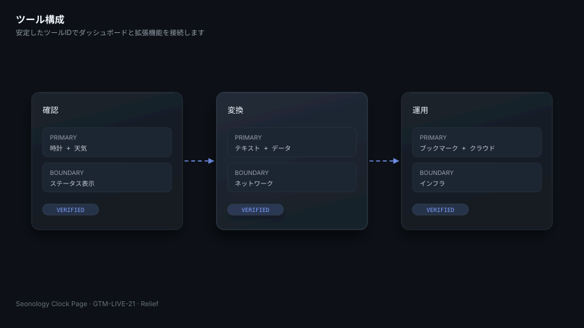
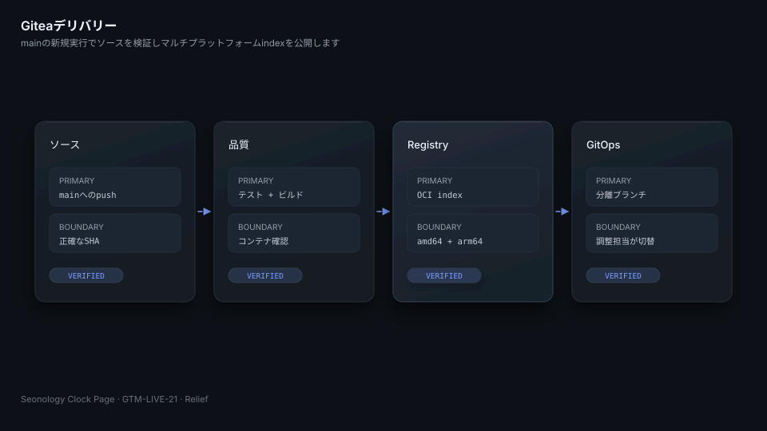
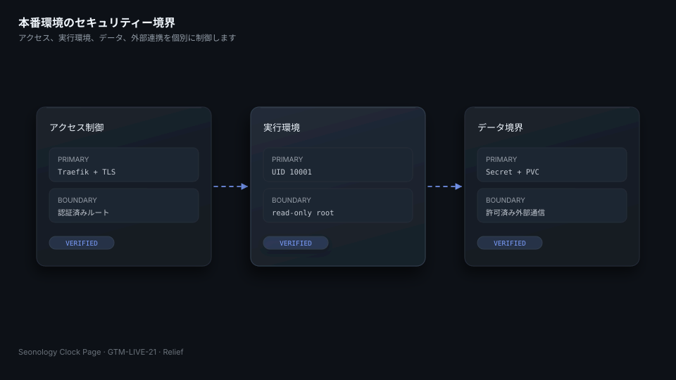

# Seonology Clock Page

[English](README.md) | [한국어](README.ko.md) | [日本語](README.ja.md)

Seonology Clock Pageは、Reactのダッシュボード、Express API、ブラウザー拡張を一つにまとめた個人向けの運用ワークスペースです。本番コンテナはnginxからViteのビルドを配信し、同じイメージ内でAPIも管理します。アーキテクチャ、ローカル開発、検証の章を先に読み、それ以降は運用時のリファレンスとして利用してください。



## 一つのコンテナからダッシュボードとAPIを配信します

ブラウザーは、ポート`8080`のnginxからReactを読み込みます。nginxは`/api`と`/health`を、ポート`3001`のExpressへ転送します。Kubernetesはブックマーク用データを`/data`にマウントし、認証情報をSecretから注入します。イメージはUID、GIDともに`10001`で動作し、ルートファイルシステムは読み取り専用です。

| パス | 役割 |
|---|---|
| `src/` | ダッシュボード、時計、ランチャー、各種ツール、共通Web UI |
| `api/` | ブックマーク、クラウドストレージ、天気、インフラ情報、外部連携 |
| `toolkit-extension/` | 共通ツールカタログを利用するViteベースのブラウザー拡張 |
| `packages/toolkit-core/` | 共通カタログとMarkdownユーティリティー |
| `k8s/` | 参照用マニフェスト。本番のdesired stateを管理する場所ではない |

## 日常的に使うツールを一つのランチャーから選べます

ダッシュボードには、時刻、天気、ブックマーク、検索、ステータス、視覚効果がまとまっています。ランチャーを使えば、変換、テキスト、ネットワーク、インフラ、クラウド、生産性向けのツールを、ページを移動せずに開けます。Web版とブラウザー拡張は安定したツールIDを共有します。



## ローカル開発では三つのロックファイルを個別にインストールします

Node.js `24.15`、または互換性のある`24.x`が必要です。ルート、API、ブラウザー拡張の依存関係を、それぞれのロックファイルからインストールします。

```sh
npm ci
npm ci --prefix api
npm ci --prefix toolkit-extension
npm run dev
npm run dev --prefix api
```

開発時のフロントエンドはViteから配信されます。APIの既定ポートは`3001`です。コミット対象になり得るファイルには、アクセストークンやパスワードを記載しないでください。

## 検証ではコード、実行環境、移行ポリシーをまとめて確認します

最初にリポジトリ契約を確認し、その後にGitea Actionsと同じ品質チェックを実行します。

```sh
python3 verify.py --repository .
npm run lint
npm run test:unit
npm run test:api
npm run test:e2e
npm run build
npm run smoke:container
```

`verify.py`は、3言語のREADME、Relief SVG 12点、ガバナンスファイル、Issueテンプレート、workflowの境界、マルチアーキテクチャ宣言、ポリシー違反、既存GitHub workflowのチェックサムを検査します。

## 実行時設定はイメージの外から注入します

`BOOKMARKS_DIR`は永続ストレージを指定します。`CLOUD_TOKEN_ENCRYPTION_KEY`はクラウドトークンを保護します。任意の連携には、リポジトリカタログ、生成サービス、Tailscale、NAS、Google Drive、OneDrive、Grafanaの認証情報を使います。本番値はExternal SecretとKubernetes Secretから取得し、ログ、テストデータ、Issue、workflowの出力には残しません。

## GiteaがCI、OCIイメージ、リリースを管理します

Giteaの`main`へpushすると、ソースと実行環境の検証が始まります。イメージworkflowは、既存のSemVerイメージを上書きせず、`main`と`sha-<commit>`のタグを付けたOCI indexをGitea Registryへ公開します。`vX.Y.Z`タグは、同じバージョンの変更不可イメージとGitea Releaseを作成します。



| Workflow | 結果 |
|---|---|
| `.gitea/workflows/ci.yml` | ソースと実行環境の全体検証 |
| `.gitea/workflows/image.yml` | `linux/amd64`と`linux/arm64`のOCI index |
| `.gitea/workflows/release.yml` | SemVerイメージとGitea Release |

既存の`.github/workflows/`は、移行の根拠としてbyte単位で維持します。新しいデリバリー設定は`.gitea/workflows/`だけで変更します。

## 本番変更は分離したGitOpsブランチで準備します

`clock.seonology.com`のdesired stateは、`seonology/seonology-k3s`リポジトリの`workloads/seonology-clock-page`で管理します。移行作業には`parallel/GTM-LIVE-21/k3s-managed-seonology-clock-page`だけを使い、中央の`main`は変更しません。Argo CDの同期、本番切り替え、運用検証は調整担当者が実施します。



Traefikが公開ルートを保護します。コンテナはcapabilityをすべて削除し、権限昇格を禁止したうえでroot権限を使わずに動作します。外部URL、OAuthトランザクション、NASパス、トークンストア、CORS、アップロード、ブラウザーメッセージには個別のテストがあります。

## コントリビューションでは文書とデリバリー設定をそろえます

コミットのタイトルは英語のConventional Commit形式で記述し、本文には変更理由と影響を韓国語で記載します。自動生成や共同作成者を示す署名は追加しません。3言語のREADMEは同じ構造を保ち、図を変更した場合は、3言語のファイルと同じpediaレコードをまとめて更新します。

本プロジェクトには[MIT License](LICENSE)が適用されます。[CONTRIBUTING.md](CONTRIBUTING.md)、[README_STRUCTURE.md](README_STRUCTURE.md)、[docs/architecture.md](docs/architecture.md)、[docs/security.md](docs/security.md)、[docs/runbook.md](docs/runbook.md)を参照してください。
