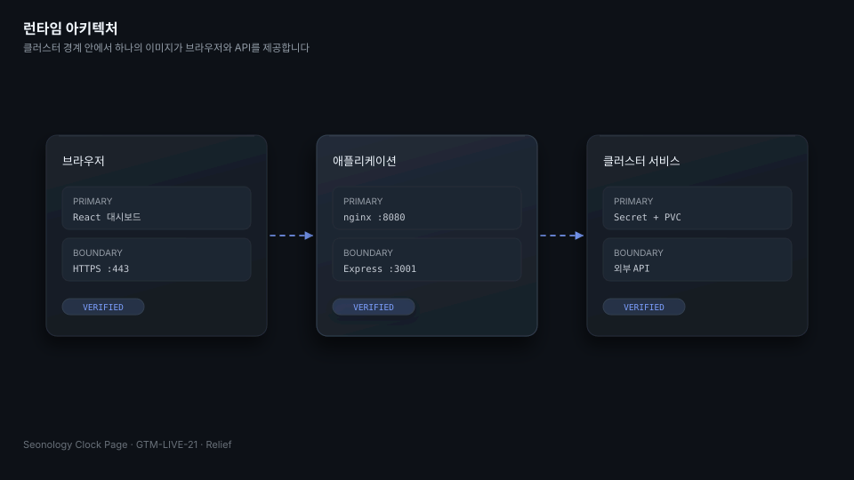
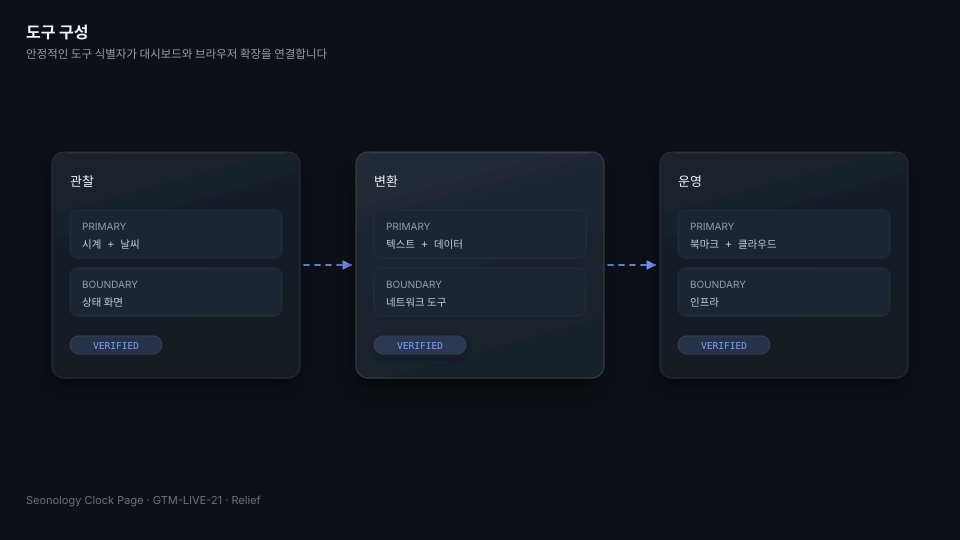
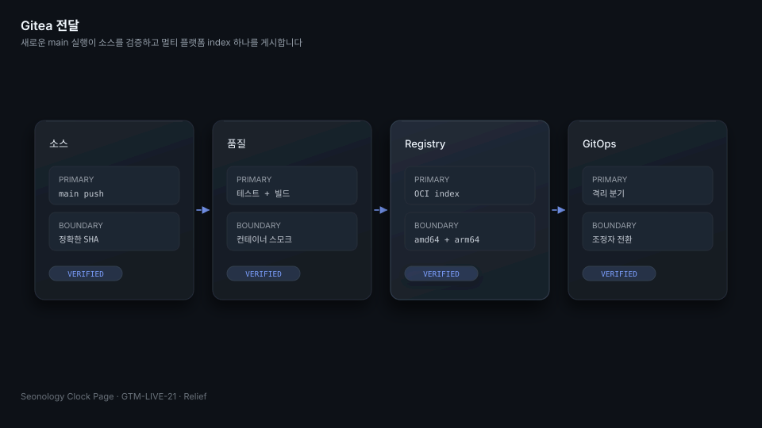
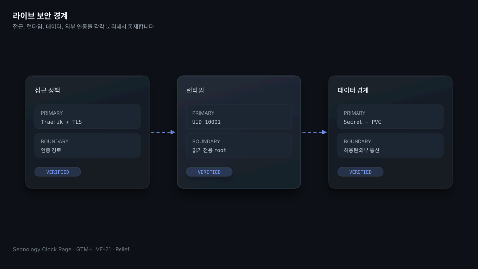

# Seonology Clock Page

[English](README.md) | [한국어](README.ko.md) | [日本語](README.ja.md)

Seonology Clock Page는 React 대시보드, Express API, 브라우저 확장을 한곳에 모은 개인 운영 작업 공간입니다. 운영 컨테이너는 nginx로 Vite 빌드를 제공하며 같은 이미지에서 API를 함께 관리합니다. 아키텍처, 로컬 개발, 검증 절을 먼저 읽고 나머지는 운영 참조 자료로 사용합니다.



## 하나의 컨테이너가 대시보드와 API를 제공합니다

브라우저는 `8080` 포트의 nginx에서 React를 불러옵니다. nginx는 `/api`와 `/health`를 `3001` 포트의 Express로 전달합니다. Kubernetes는 북마크 데이터를 `/data`에 마운트하고 자격증명을 Secret으로 주입합니다. 이미지는 UID와 GID `10001`로 실행되며 루트 파일 시스템은 읽기 전용입니다.

| 경로 | 담당 기능 |
|---|---|
| `src/` | 대시보드, 시계, 실행기, 도구, 공통 웹 화면 |
| `api/` | 북마크, 클라우드 저장소, 날씨, 인프라 데이터, 외부 연동 |
| `toolkit-extension/` | 공통 도구 카탈로그를 사용하는 Vite 기반 브라우저 확장 |
| `packages/toolkit-core/` | 공통 카탈로그와 Markdown 유틸리티 |
| `k8s/` | 참고용 매니페스트이며 라이브 desired state 원본은 아님 |

## 실행기 하나에서 일상 도구를 분야별로 찾을 수 있습니다

대시보드는 시간, 날씨, 북마크, 검색, 상태, 시각 효과를 한 화면에 표시합니다. 실행기에서는 변환, 텍스트, 네트워크, 인프라, 클라우드, 생산성 도구를 페이지 이동 없이 열 수 있습니다. 웹과 브라우저 확장은 안정적인 도구 식별자를 공유합니다.



## 로컬 개발에서는 잠금 파일 세 개를 각각 설치합니다

Node.js `24.15` 또는 호환되는 `24.x` 버전이 필요합니다. 루트, API, 브라우저 확장의 잠금 파일을 각각 설치합니다.

```sh
npm ci
npm ci --prefix api
npm ci --prefix toolkit-extension
npm run dev
npm run dev --prefix api
```

개발 환경에서는 Vite가 프런트엔드를 제공합니다. API의 기본 포트는 `3001`입니다. 커밋될 수 있는 파일에는 접근 토큰이나 비밀번호를 기록하지 않습니다.

## 검증은 코드, 런타임, 이전 정책을 함께 확인합니다

저장소 계약을 먼저 확인한 뒤 Gitea Actions와 같은 품질 명령을 실행합니다.

```sh
python3 verify.py --repository .
npm run lint
npm run test:unit
npm run test:api
npm run test:e2e
npm run build
npm run smoke:container
```

`verify.py`는 README 세 개, Relief SVG 12개, 거버넌스 파일, 이슈 템플릿, workflow 경계, 멀티 아키텍처 선언, 정책 위반, 기존 GitHub workflow 체크섬을 검사합니다.

## 런타임 설정은 이미지 밖에서 주입합니다

`BOOKMARKS_DIR`은 영구 저장소를 지정합니다. `CLOUD_TOKEN_ENCRYPTION_KEY`는 클라우드 토큰을 보호합니다. 선택적 연동에는 저장소 카탈로그, 생성형 서비스, Tailscale, NAS, Google Drive, OneDrive, Grafana 자격증명이 필요합니다. 라이브 값은 External Secret과 Kubernetes Secret에서 가져오며 로그, 테스트 데이터, 이슈, workflow 출력에는 남기지 않습니다.

## Gitea가 CI, OCI 이미지, 릴리스를 관리합니다

Gitea `main`에 push하면 소스와 런타임 검증이 실행됩니다. 이미지 workflow는 기존 SemVer 이미지를 덮어쓰지 않고 Gitea Registry에 `main`과 `sha-<commit>` 태그의 OCI index를 게시합니다. `vX.Y.Z` 태그는 같은 버전의 변경 불가능한 이미지와 Gitea Release를 생성합니다.



| Workflow | 결과 |
|---|---|
| `.gitea/workflows/ci.yml` | 소스와 런타임 전체 검증 |
| `.gitea/workflows/image.yml` | `linux/amd64`와 `linux/arm64` OCI index |
| `.gitea/workflows/release.yml` | SemVer 이미지와 Gitea Release |

기존 `.github/workflows/` 파일은 이전 근거로서 byte 단위로 유지합니다. 새로운 전달 방식은 `.gitea/workflows/`에서만 변경합니다.

## 라이브 변경은 격리된 GitOps 분기에서 준비합니다

`clock.seonology.com`의 desired state는 `seonology/seonology-k3s` 저장소의 `workloads/seonology-clock-page`에서 관리합니다. 이전 작업은 `parallel/GTM-LIVE-21/k3s-managed-seonology-clock-page` 분기만 사용하며 중앙 `main`은 변경하지 않습니다. Argo CD 동기화, 라이브 전환, 운영 검증은 조정자가 수행합니다.



Traefik이 공개 경로를 보호합니다. 컨테이너는 capability를 모두 제거하고 권한 상승을 금지하며 root 권한 없이 실행됩니다. 외부 URL, OAuth 트랜잭션, NAS 경로, 토큰 저장소, CORS, 업로드, 브라우저 메시지에는 각각의 테스트가 있습니다.

## 기여할 때에는 문서와 전달 설정을 함께 맞춥니다

커밋 제목은 영어 Conventional Commit 형식으로 작성하고 본문에는 변경 이유와 영향을 한국어로 적습니다. 자동 생성이나 공동 작성자 서명은 추가하지 않습니다. README 세 개의 구조를 맞추고 다이어그램을 변경하면 세 언어 파일과 동일한 pedia 레코드를 함께 갱신합니다.

이 프로젝트는 [MIT License](LICENSE)를 사용합니다. [CONTRIBUTING.md](CONTRIBUTING.md), [README_STRUCTURE.md](README_STRUCTURE.md), [docs/architecture.md](docs/architecture.md), [docs/security.md](docs/security.md), [docs/runbook.md](docs/runbook.md)를 참조하십시오.
