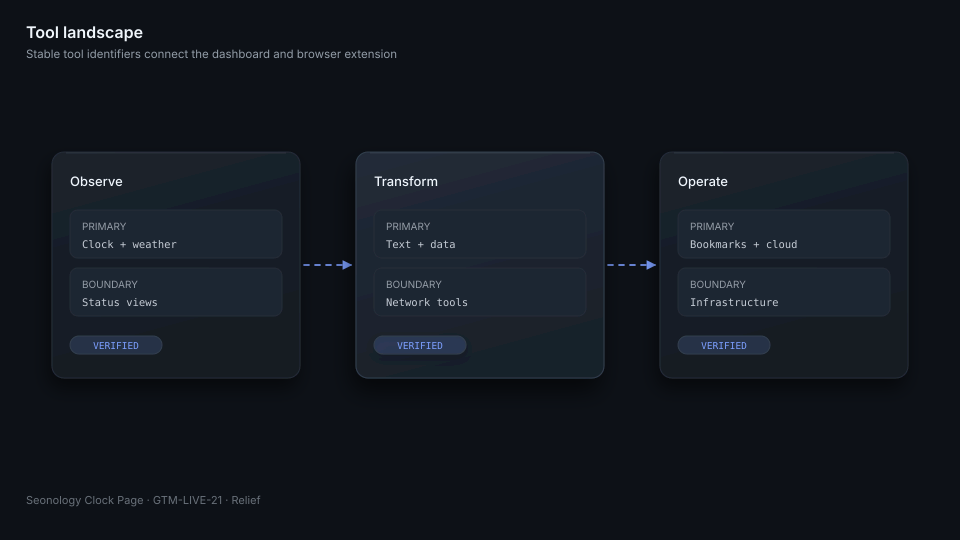
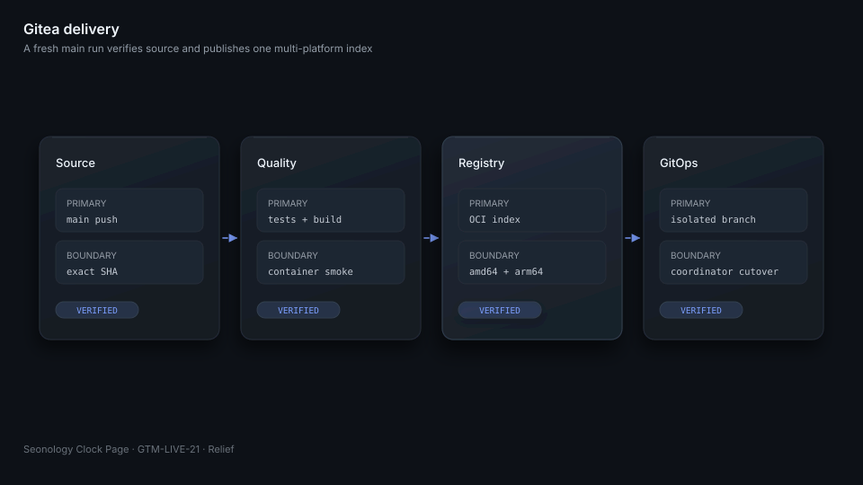
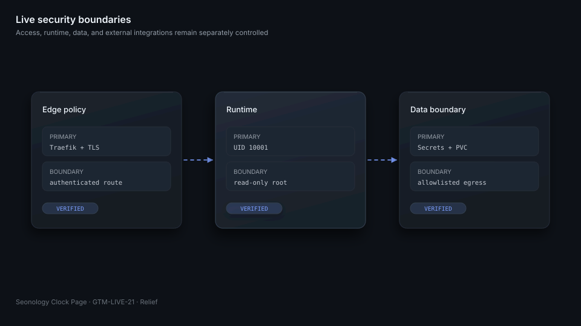

# Seonology Clock Page

[English](README.md) | [한국어](README.ko.md) | [日本語](README.ja.md)

Seonology Clock Page combines a React dashboard, an Express API, and browser extensions in one private operations workspace. The production container serves the Vite build through nginx and supervises the API in the same image. Read the architecture, local development, and verification sections first; use the remaining sections as an operations reference.


## One container serves the dashboard and API

The browser loads React from nginx on port `8080`. nginx forwards `/api` and `/health` to Express on port `3001`. Kubernetes mounts bookmark data at `/data` and injects credentials through Secrets. The image runs as UID and GID `10001` with a read-only root filesystem.

| Path | Responsibility |
|---|---|
| `src/` | Dashboard, clock, launcher, tools, and shared web UI |
| `api/` | Bookmarks, cloud storage, weather, infrastructure data, and integrations |
| `toolkit-extension/` | Vite-based extension built from the shared tool catalog |
| `packages/toolkit-core/` | Shared catalog and Markdown utilities |
| `k8s/` | Reference manifests, not the live desired-state source |

## The launcher groups daily tools behind one surface

The dashboard combines time, weather, bookmarks, search, status, and visual effects. The launcher opens conversion, text, network, infrastructure, cloud, and productivity tools without leaving the page. Web and extension implementations share stable tool identifiers.



## Local development uses three locked dependency sets

Node.js `24.15` or a compatible `24.x` release is required. Install the root, API, and extension lockfiles independently.

```sh
npm ci
npm ci --prefix api
npm ci --prefix toolkit-extension
npm run dev
npm run dev --prefix api
```

The Vite server provides the frontend during development. The API listens on `3001` by default. Never place access tokens or passwords in files that can be committed.

## Verification covers code, runtime, and migration policy

Run the repository contract before the same quality commands used by Gitea Actions.

```sh
python3 verify.py --repository .
npm run lint
npm run test:unit
npm run test:api
npm run test:e2e
npm run build
npm run smoke:container
```

`verify.py` checks the three README files, twelve Relief SVG files, governance files, issue templates, workflow boundaries, multi-architecture declarations, policy violations, and the original GitHub workflow checksums.

## Runtime settings stay outside the image

`BOOKMARKS_DIR` selects persistent storage. `CLOUD_TOKEN_ENCRYPTION_KEY` protects cloud tokens. Optional integrations use catalog, generative service, Tailscale, NAS, Google Drive, OneDrive, and Grafana credentials. Live values come from External Secrets and Kubernetes Secrets; logs, fixtures, issues, and workflow output must never contain them.

## Gitea owns CI, OCI images, and releases

A push to Gitea `main` runs source and runtime verification. The image workflow publishes a Gitea Registry OCI index tagged `main` and `sha-<commit>` without overwriting existing SemVer images. A `vX.Y.Z` tag creates the matching immutable image and Gitea release.



| Workflow | Result |
|---|---|
| `.gitea/workflows/ci.yml` | Full source and runtime verification |
| `.gitea/workflows/image.yml` | `linux/amd64` and `linux/arm64` OCI index |
| `.gitea/workflows/release.yml` | SemVer image and Gitea release |

The original `.github/workflows/` files remain byte-identical migration evidence. New delivery changes belong only in `.gitea/workflows/`.

## Live changes are prepared on an isolated GitOps branch

The desired state for `clock.seonology.com` lives in `seonology/seonology-k3s` under `workloads/seonology-clock-page`. Migration work uses `parallel/GTM-LIVE-21/k3s-managed-seonology-clock-page` and never updates central `main`. Argo CD synchronization, cutover, and live validation remain coordinator actions.



Traefik protects the public route. The container drops capabilities, forbids privilege escalation, and runs without root. External URLs, OAuth transactions, NAS paths, token storage, CORS, uploads, and browser messages have focused tests.

## Contributions keep documentation and delivery aligned

Use an English Conventional Commit title and a Korean body that explains the reason and impact. Do not add automated authorship signatures. Keep all three README files structurally aligned and update all three language variants plus the same pedia records when a diagram changes.

The project uses the [MIT License](LICENSE). See [CONTRIBUTING.md](CONTRIBUTING.md), [README_STRUCTURE.md](README_STRUCTURE.md), [docs/architecture.md](docs/architecture.md), [docs/security.md](docs/security.md), and [docs/runbook.md](docs/runbook.md).
